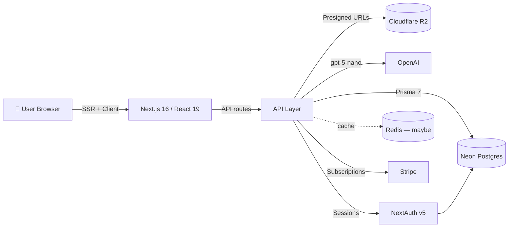
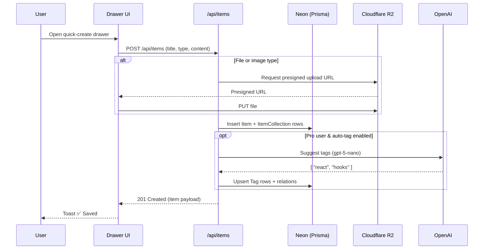

# Architecture

DevStash is a Next.js 16 App Router app: a searchable hub for snippets, prompts, commands, notes, links, files, and images.

## 🗺️ URL Patterns

| Route              | Purpose                                                    |
| ------------------ | ---------------------------------------------------------- |
| `/`                | Dashboard (collections grid)                               |
| `/items/:type`     | List of all items of a given type (e.g. `/items/snippets`) |
| `/items/:id`       | Item detail (rendered in drawer)                           |
| `/collections`     | All collections                                            |
| `/collections/:id` | Items inside a collection                                  |
| `/settings`        | Profile, billing, preferences                              |
| `/api/*`           | API routes (items, uploads, AI, Stripe webhooks, auth)     |

---

## 🏗️ Architecture



### Request lifecycle for creating an item



---

## Key architectural decisions

- **Server-first rendering.** Server components are the default and call Prisma directly; client components exist only for interactivity (forms, sidebar state, theme toggle, `useActionState`). Async sections in the dashboard stream independently behind their own `<Suspense>` boundaries.
- **Split NextAuth config.** `src/auth.config.ts` is edge-safe (provider shape, `pages`, `authorized` callback) and is what `src/proxy.ts` runs at the edge to gate `PROTECTED_ROUTES`. `src/auth.ts` is the Node-runtime instance with `PrismaAdapter`, JWT sessions, and the real Credentials `authorize` (bcrypt + `emailVerified` check). This keeps Prisma and bcrypt out of the edge bundle.
- **`proxy.ts` instead of `middleware.ts`.** Next 16 deprecates middleware; the matcher in `proxy.ts` excludes static assets.
- **Server actions over client `signIn`.** Client-side `next-auth/react` had unreliable OAuth redirect timing, so auth submits go through server actions that call `signIn(..., { redirectTo })` and let `NEXT_REDIRECT` propagate.
- **Single Prisma client.** `src/lib/db.ts` exports a `server-only` singleton built with `PrismaNeon` adapter. Never instantiate `PrismaClient` elsewhere — the one exception is `prisma/seed.ts`, which runs outside Next.
- **Multi-tenant by query scoping.** Every DB helper takes a `userId` from `getCurrentUserId()` (React-cached, throws if unauthenticated). There is no row-level enforcement below that.
- **Prisma 7 generated client in `src/generated/prisma`** (gitignored, ESM-only — hence `"type": "module"`).
- **Migrations only via `prisma migrate dev` / `deploy`.** Never `db push` or direct DB edits. Two Neon branches: `development` (default) and `production` (off-limits without explicit instruction).
- **Email verification is single-use, 24h TTL.** Tokens are 32-byte hex; prior tokens for the same email are deleted on issue. `SKIP_EMAIL_VERIFICATION` is the dev bypass.
- **Freemium gate is data-model-aware but currently open.** Pro flags exist on `User`; during development all users get everything.

## How to use server actions

Server actions are async functions in a file marked `"use server"`. They run on the server, can read the session, and can be called directly from client components.

**File layout.** Put actions in `src/actions/<feature>.ts`. Anything non-async (types, constants, initial state for `useActionState`) must live in a sibling file without `"use server"` — Next forbids non-async exports from a `"use server"` module. See `src/actions/auth-state.ts` for the pattern.

**Validate inputs with Zod.** Reuse the schemas in `src/lib/schemas/`. Use `safeParse` and return a typed error result instead of throwing for expected validation failures.

**Two ways to invoke:**

1. **Direct call from a client component** — typical for RHF submit handlers:

   ```tsx
   "use client";
   const onSubmit = form.handleSubmit(async (values) => {
     const res = await signInWithCredentials(values);
     if (res?.code) toast.error(res.message);
   });
   ```

2. **Form `action` prop** — when you want progressive enhancement or `useActionState`:

   ```tsx
   <form action={signInWithGitHub}>
     <button type="submit">Sign in with GitHub</button>
   </form>
   ```

   For stateful flows (e.g. `ResendVerificationButton`), pair with `useActionState(action, initialState)` and pass hidden inputs for any extra args.

**Redirects.** Call `signIn(..., { redirectTo })` or `redirect()` inside the action. They throw `NEXT_REDIRECT` — do not catch it. Only catch specific errors (e.g. `AuthError`) and re-throw anything you didn't expect.

**Session access.** Read the user via `getCurrentUserId()` / `getCurrentUser()` from `src/lib/session.ts`; both are React-cached.

**Revalidation.** After a mutation that affects rendered data, call `revalidatePath(...)` or `revalidateTag(...)` before returning.
