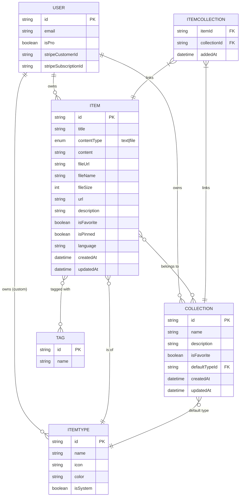

### Prisma Schema (draft)

```prisma
// prisma/schema.prisma
generator client {
  provider = "prisma-client-js"
}

datasource db {
  provider = "postgresql"
  url      = env("DATABASE_URL")
}

// -----------------------------------------------------------------------------
// Auth (NextAuth v5 — Prisma adapter shape)
// -----------------------------------------------------------------------------
model User {
  id                   String    @id @default(cuid())
  name                 String?
  email                String    @unique
  emailVerified        DateTime?
  image                String?

  // Billing
  isPro                Boolean   @default(false)
  stripeCustomerId     String?   @unique
  stripeSubscriptionId String?   @unique

  // Relations
  accounts     Account[]
  sessions     Session[]
  items        Item[]
  collections  Collection[]
  customTypes  ItemType[]

  createdAt DateTime @default(now())
  updatedAt DateTime @updatedAt
}

model Account {
  id                String  @id @default(cuid())
  userId            String
  type              String
  provider          String
  providerAccountId String
  refresh_token     String? @db.Text
  access_token      String? @db.Text
  expires_at        Int?
  token_type        String?
  scope             String?
  id_token          String? @db.Text
  session_state     String?

  user User @relation(fields: [userId], references: [id], onDelete: Cascade)

  @@unique([provider, providerAccountId])
}

model Session {
  id           String   @id @default(cuid())
  sessionToken String   @unique
  userId       String
  expires      DateTime
  user         User     @relation(fields: [userId], references: [id], onDelete: Cascade)
}

model VerificationToken {
  identifier String
  token      String   @unique
  expires    DateTime

  @@unique([identifier, token])
}

// -----------------------------------------------------------------------------
// Core domain
// -----------------------------------------------------------------------------
enum ContentType {
  TEXT
  FILE
}

model ItemType {
  id       String  @id @default(cuid())
  name     String
  icon     String
  color    String
  isSystem Boolean @default(false)

  // null for system types; set for user-defined custom types (future)
  userId   String?
  user     User?   @relation(fields: [userId], references: [id], onDelete: Cascade)

  items               Item[]
  defaultForCollections Collection[] @relation("CollectionDefaultType")

  @@unique([userId, name])
}

model Item {
  id          String      @id @default(cuid())
  title       String
  contentType ContentType
  content     String?     @db.Text // text content, null if file
  fileUrl     String?     // R2 URL, null if text
  fileName    String?
  fileSize    Int?
  url         String?     // for `link` types
  description String?
  isFavorite  Boolean     @default(false)
  isPinned    Boolean     @default(false)
  language    String?     // optional for code snippets

  userId     String
  user       User     @relation(fields: [userId], references: [id], onDelete: Cascade)

  itemTypeId String
  itemType   ItemType @relation(fields: [itemTypeId], references: [id])

  collections ItemCollection[]
  tags        TagOnItem[]

  createdAt DateTime @default(now())
  updatedAt DateTime @updatedAt

  @@index([userId])
  @@index([itemTypeId])
}

model Collection {
  id           String   @id @default(cuid())
  name         String
  description  String?
  isFavorite   Boolean  @default(false)

  defaultTypeId String?
  defaultType   ItemType? @relation("CollectionDefaultType", fields: [defaultTypeId], references: [id])

  userId String
  user   User   @relation(fields: [userId], references: [id], onDelete: Cascade)

  items ItemCollection[]

  createdAt DateTime @default(now())
  updatedAt DateTime @updatedAt

  @@index([userId])
}

model ItemCollection {
  itemId       String
  collectionId String
  addedAt      DateTime @default(now())

  item       Item       @relation(fields: [itemId], references: [id], onDelete: Cascade)
  collection Collection @relation(fields: [collectionId], references: [id], onDelete: Cascade)

  @@id([itemId, collectionId])
  @@index([collectionId])
}

model Tag {
  id    String      @id @default(cuid())
  name  String      @unique
  items TagOnItem[]
}

model TagOnItem {
  itemId String
  tagId  String

  item Item @relation(fields: [itemId], references: [id], onDelete: Cascade)
  tag  Tag  @relation(fields: [tagId], references: [id], onDelete: Cascade)

  @@id([itemId, tagId])
}
```

> ⚠️ **Migration rule:** NEVER use `prisma db push` or mutate the DB structure directly. All schema changes go through `prisma migrate dev` locally, then `prisma migrate deploy` in production.

## 🧱 Data Model

### Entity-Relationship Diagram



---

## Database (Prisma 7 + Neon)

- Schema lives at `prisma/schema.prisma`. The generator uses the new `prisma-client` provider (Rust-free) and writes the client to `src/generated/prisma` (gitignored — regenerated by `prisma generate`).
- Project-level config lives in `prisma.config.ts` at the repo root (Prisma 7 no longer auto-loads `.env`; `prisma.config.ts` imports `dotenv/config`).
- The runtime client is the singleton in [src/lib/db.ts](src/lib/db.ts), which builds `PrismaClient` with a `PrismaNeon` driver adapter from a `DATABASE_URL` connection string. Always import `prisma` from `@/lib/db` — never instantiate a new `PrismaClient`.
- Set `DATABASE_URL` in `.env` (see `.env.example`). Use the **pooled** Neon connection string. We have two Neon branches: development (default in `.env`) and production. Migrations should always be applied to dev first, then deployed to prod via `prisma migrate deploy` in CI.
- **Migration rule:** never use `prisma db push` or modify the database directly. All schema changes go through `prisma migrate dev` locally; CI runs `prisma migrate deploy`. Run `prisma migrate status` before committing to confirm migrations are in sync.
- Prisma 7 breaking points to remember when changing schema/setup:
  - Generator must declare `output` (no default `node_modules/@prisma/client`).
  - Driver adapter (`@prisma/adapter-neon`) is mandatory — `new PrismaClient({ adapter })`.
  - No automatic seeding — run `prisma db seed` explicitly when we add a seed script.
  - Removed `prisma.$use()` middleware — use `prisma.$extends()` instead.

## Neon MCP

- **Project:** always use the `devstash` project when calling Neon MCP tools.
- **Branch:** always use the `development` branch by default.
- **Production is off-limits:** never read from, write to, run queries against, or alter the `production` branch (or any branch connected to the production `DATABASE_URL`) unless I explicitly say "use production" or "production branch" in that message.
- If you are unsure which branch a Neon MCP operation targets, ask before proceeding.
