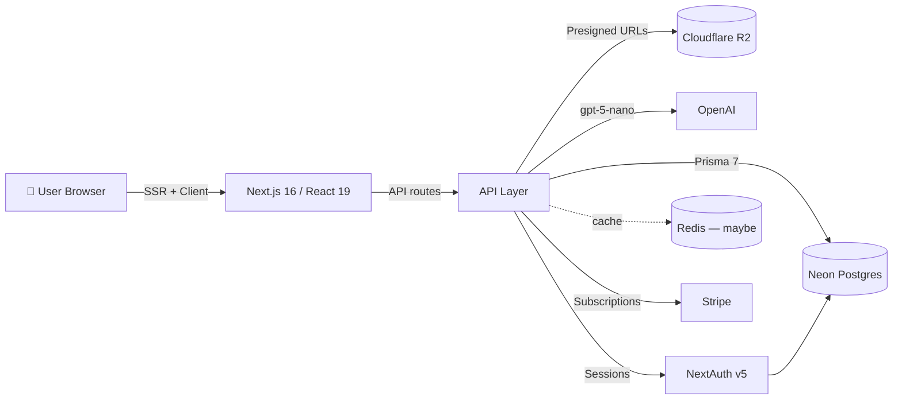
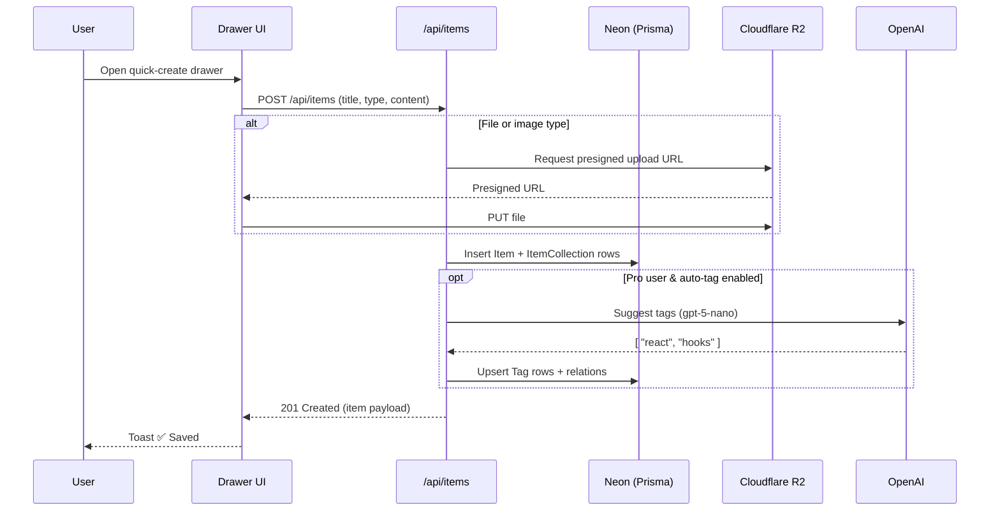
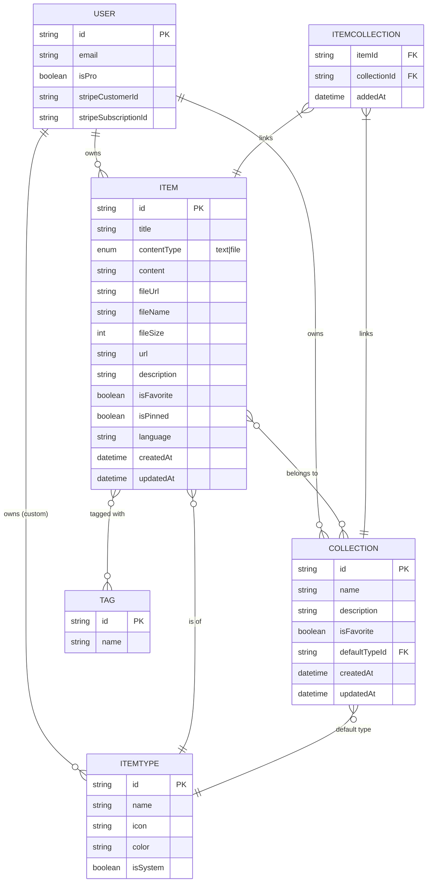

# 📦 DevStash — Project Overview

> **One fast, searchable, AI-enhanced hub for all developer knowledge & resources.**

DevStash is a SaaS that gives developers a single home for the essentials they currently scatter across VS Code, Notion, ChatGPT, bookmarks, gists, and random `.txt` files. Store snippets, prompts, commands, notes, links, and files — then find them instantly.

---

## 🎯 The Problem

Developers keep their essentials scattered across many tools:

| 🧩 Asset          | 📍 Where it usually lives      |
| ----------------- | ------------------------------ |
| Code snippets     | VS Code, Notion                |
| AI prompts        | ChatGPT / Claude conversations |
| Context files     | Buried inside project folders  |
| Useful links      | Browser bookmarks              |
| Docs              | Random folders                 |
| Commands          | Loose `.txt` files             |
| Project templates | GitHub gists                   |
| Terminal commands | `~/.bash_history`              |

The result: **context switching, lost knowledge, and inconsistent workflows**.

**DevStash fixes this** by providing a fast, searchable, AI-enhanced hub for everything a developer needs to reach for repeatedly.

---

## 👥 Target Users

- **Everyday Developer** — needs a fast way to grab snippets, prompts, commands, links.
- **AI-first Developer** — saves prompts, contexts, workflows, system messages.
- **Content Creator / Educator** — stores code blocks, explanations, course notes.
- **Full-stack Builder** — collects patterns, boilerplates, API examples.

---

## ✨ Features

### A. Items & Item Types

Every stashed asset is an **Item**. Items have a **type**. Users can create custom types later, but DevStash ships with these system types (immutable):

| Type      | Content Kind | Tier    | Example                       |
| --------- | ------------ | ------- | ----------------------------- |
| `snippet` | text         | Free    | Reusable code blocks          |
| `prompt`  | text         | Free    | LLM prompts / system messages |
| `note`    | text         | Free    | Markdown notes                |
| `command` | text         | Free    | Shell / CLI commands          |
| `link`    | url          | Free    | Useful URLs                   |
| `file`    | file         | **Pro** | Context files, PDFs, etc.     |
| `image`   | file         | **Pro** | Screenshots, diagrams         |

- A type resolves to one of: `text`, `url`, or `file`.
- Type listing URLs follow the pattern `/items/snippets`, `/items/prompts`, etc.
- Items are **quick to access and create** via a slide-in drawer.

### B. Collections

Users group items into **Collections**. An item can belong to **multiple collections** (many-to-many), e.g. a React snippet in both _React Patterns_ and _Interview Prep_.

Example collections:

- **React Patterns** (snippets, notes)
- **Context Files** (files)
- **Python Snippets** (snippets)

### C. Search

Powerful search across:

- Content
- Tags
- Titles
- Types

### D. Authentication

- Email / password
- GitHub OAuth

### E. Quality-of-Life

- Collection & item favorites
- Pin items to the top
- Recently used
- Import code from a file
- Markdown editor for text types
- File upload for file / image types
- Export data in multiple formats
- Dark mode (default for devs)
- Add / remove items across multiple collections
- View which collections an item belongs to

### F. 🤖 AI Features (Pro only)

- AI auto-tag suggestions
- AI summaries
- AI "Explain This Code"
- Prompt optimizer

---

## 🏗️ Architecture



### Request lifecycle for creating an item



---

## 🧱 Data Model

### Entity-Relationship Diagram



### Prisma Schema (draft)

```prisma
// prisma/schema.prisma
generator client {
  provider = "prisma-client-js"
}

datasource db {
  provider = "postgresql"
  url      = env("DATABASE_URL")
}

// -----------------------------------------------------------------------------
// Auth (NextAuth v5 — Prisma adapter shape)
// -----------------------------------------------------------------------------
model User {
  id                   String    @id @default(cuid())
  name                 String?
  email                String    @unique
  emailVerified        DateTime?
  image                String?

  // Billing
  isPro                Boolean   @default(false)
  stripeCustomerId     String?   @unique
  stripeSubscriptionId String?   @unique

  // Relations
  accounts     Account[]
  sessions     Session[]
  items        Item[]
  collections  Collection[]
  customTypes  ItemType[]

  createdAt DateTime @default(now())
  updatedAt DateTime @updatedAt
}

model Account {
  id                String  @id @default(cuid())
  userId            String
  type              String
  provider          String
  providerAccountId String
  refresh_token     String? @db.Text
  access_token      String? @db.Text
  expires_at        Int?
  token_type        String?
  scope             String?
  id_token          String? @db.Text
  session_state     String?

  user User @relation(fields: [userId], references: [id], onDelete: Cascade)

  @@unique([provider, providerAccountId])
}

model Session {
  id           String   @id @default(cuid())
  sessionToken String   @unique
  userId       String
  expires      DateTime
  user         User     @relation(fields: [userId], references: [id], onDelete: Cascade)
}

model VerificationToken {
  identifier String
  token      String   @unique
  expires    DateTime

  @@unique([identifier, token])
}

// -----------------------------------------------------------------------------
// Core domain
// -----------------------------------------------------------------------------
enum ContentType {
  TEXT
  FILE
}

model ItemType {
  id       String  @id @default(cuid())
  name     String
  icon     String
  color    String
  isSystem Boolean @default(false)

  // null for system types; set for user-defined custom types (future)
  userId   String?
  user     User?   @relation(fields: [userId], references: [id], onDelete: Cascade)

  items               Item[]
  defaultForCollections Collection[] @relation("CollectionDefaultType")

  @@unique([userId, name])
}

model Item {
  id          String      @id @default(cuid())
  title       String
  contentType ContentType
  content     String?     @db.Text // text content, null if file
  fileUrl     String?     // R2 URL, null if text
  fileName    String?
  fileSize    Int?
  url         String?     // for `link` types
  description String?
  isFavorite  Boolean     @default(false)
  isPinned    Boolean     @default(false)
  language    String?     // optional for code snippets

  userId     String
  user       User     @relation(fields: [userId], references: [id], onDelete: Cascade)

  itemTypeId String
  itemType   ItemType @relation(fields: [itemTypeId], references: [id])

  collections ItemCollection[]
  tags        TagOnItem[]

  createdAt DateTime @default(now())
  updatedAt DateTime @updatedAt

  @@index([userId])
  @@index([itemTypeId])
}

model Collection {
  id           String   @id @default(cuid())
  name         String
  description  String?
  isFavorite   Boolean  @default(false)

  defaultTypeId String?
  defaultType   ItemType? @relation("CollectionDefaultType", fields: [defaultTypeId], references: [id])

  userId String
  user   User   @relation(fields: [userId], references: [id], onDelete: Cascade)

  items ItemCollection[]

  createdAt DateTime @default(now())
  updatedAt DateTime @updatedAt

  @@index([userId])
}

model ItemCollection {
  itemId       String
  collectionId String
  addedAt      DateTime @default(now())

  item       Item       @relation(fields: [itemId], references: [id], onDelete: Cascade)
  collection Collection @relation(fields: [collectionId], references: [id], onDelete: Cascade)

  @@id([itemId, collectionId])
  @@index([collectionId])
}

model Tag {
  id    String      @id @default(cuid())
  name  String      @unique
  items TagOnItem[]
}

model TagOnItem {
  itemId String
  tagId  String

  item Item @relation(fields: [itemId], references: [id], onDelete: Cascade)
  tag  Tag  @relation(fields: [tagId], references: [id], onDelete: Cascade)

  @@id([itemId, tagId])
}
```

> ⚠️ **Migration rule:** NEVER use `prisma db push` or mutate the DB structure directly. All schema changes go through `prisma migrate dev` locally, then `prisma migrate deploy` in production.

---

## 🧰 Tech Stack

| Layer            | Choice                                                                           | Notes                                                           |
| ---------------- | -------------------------------------------------------------------------------- | --------------------------------------------------------------- |
| **Framework**    | [Next.js 16](https://nextjs.org/docs) / [React 19](https://react.dev)            | SSR pages with dynamic components; API routes for backend needs |
| **Language**     | [TypeScript](https://www.typescriptlang.org/docs/)                               | Type safety across the stack                                    |
| **Database**     | [Neon Postgres](https://neon.tech/docs)                                          | Serverless Postgres in the cloud                                |
| **ORM**          | [Prisma 7](https://www.prisma.io/docs)                                           | Always pull latest docs before using                            |
| **Cache**        | [Redis](https://redis.io/docs/) _(maybe)_                                        | Optional, for hot reads                                         |
| **File Storage** | [Cloudflare R2](https://developers.cloudflare.com/r2/)                           | S3-compatible, no egress fees                                   |
| **Auth**         | [NextAuth v5](https://authjs.dev/)                                               | Email/password + GitHub OAuth                                   |
| **AI**           | [OpenAI `gpt-5-nano`](https://platform.openai.com/docs)                          | Tagging, summaries, explanations, prompt optimizer              |
| **Styling**      | [Tailwind v4](https://tailwindcss.com/docs) + [shadcn/ui](https://ui.shadcn.com) | Design system + primitives                                      |
| **Payments**     | [Stripe](https://docs.stripe.com)                                                | Subscriptions                                                   |
| **Icons**        | [Lucide](https://lucide.dev)                                                     | Consistent, clean iconography                                   |

**Mono-repo:** one codebase / one repo for less overhead.

---

## 💰 Monetization — Freemium

| Capability              | 🆓 Free                 | 💎 Pro ($8/mo or $72/yr) |
| ----------------------- | ----------------------- | ------------------------ |
| Items                   | 50 total                | Unlimited                |
| Collections             | 3                       | Unlimited                |
| System types            | All except file / image | All                      |
| File & image uploads    | ❌                      | ✅                       |
| Custom types _(future)_ | ❌                      | ✅                       |
| Search                  | Basic                   | Basic                    |
| AI auto-tagging         | ❌                      | ✅                       |
| AI code explanation     | ❌                      | ✅                       |
| AI prompt optimizer     | ❌                      | ✅                       |
| Export (JSON / ZIP)     | ❌                      | ✅                       |
| Support                 | Community               | Priority                 |

> 🛠️ **Dev note:** Build the Pro/Free gate into the data model and middleware from day one, but during development **all users get everything** so features are easy to test.

---

## 🎨 UI / UX

### Feel

- Modern, minimal, developer-focused
- **Dark mode default**, light mode optional
- Clean typography, generous whitespace
- Subtle borders and shadows
- References: [Notion](https://notion.so), [Linear](https://linear.app), [Raycast](https://raycast.com)
- Syntax highlighting on code blocks

### Layout

```
┌──────────────┬────────────────────────────────────────┐
│   SIDEBAR    │              MAIN CONTENT              │
│  (collapse)  │                                        │
│              │   ┌──────────┐  ┌──────────┐           │
│ Snippets     │   │ React    │  │ Python   │  …        │
│ Prompts      │   │ Patterns │  │ Snippets │           │
│ Commands     │   └──────────┘  └──────────┘           │
│ Notes        │                                        │
│ Files (Pro)  │   Items (color-coded border cards)     │
│ Images (Pro) │   ┌──────────┐ ┌──────────┐ ┌─────────┐│
│ Links        │   │ useDebou │ │ git rese │ │ claude  ││
│              │   │ nce.ts   │ │ --hard   │ │ prompt  ││
│ Collections  │   └──────────┘ └──────────┘ └─────────┘│
│  ★ React     │                                        │
│  ★ Prompts   │   [ + New Item ]  → opens drawer →     │
└──────────────┴────────────────────────────────────────┘
```

- **Sidebar:** item types with links to their listings, plus latest collections.
- **Main:** grid of collection cards. Card **background color** = the dominant item type; item **border color** = its type.
- **Item detail:** opens in a slide-in drawer for quick access and creation.

### Design tokens — Types

| Type    | Icon (lucide) | Color      | Hex       |
| ------- | ------------- | ---------- | --------- |
| Snippet | `Code`        | 🔵 Blue    | `#3b82f6` |
| Prompt  | `Sparkles`    | 🟣 Purple  | `#8b5cf6` |
| Command | `Terminal`    | 🟠 Orange  | `#f97316` |
| Note    | `StickyNote`  | 🟡 Yellow  | `#fde047` |
| File    | `File`        | ⚫ Gray    | `#6b7280` |
| Image   | `Image`       | 🩷 Pink    | `#ec4899` |
| Link    | `Link`        | 🟢 Emerald | `#10b981` |

### Screenshots

Refer to the screenshots below as a base the dashboard ui. It does not to be exact. Use it as a reference:

- @context/screenshots/dashboard-ui-main.png
- @context/screenshots/dashboard-ui-drawer.png

### Responsive

- **Desktop-first**, mobile usable.
- Sidebar collapses into a drawer on mobile.

### Micro-interactions

- Smooth transitions
- Card hover states
- Toast notifications on actions
- Loading skeletons

---

## 🗺️ URL Patterns

| Route              | Purpose                                                    |
| ------------------ | ---------------------------------------------------------- |
| `/`                | Dashboard (collections grid)                               |
| `/items/:type`     | List of all items of a given type (e.g. `/items/snippets`) |
| `/items/:id`       | Item detail (rendered in drawer)                           |
| `/collections`     | All collections                                            |
| `/collections/:id` | Items inside a collection                                  |
| `/settings`        | Profile, billing, preferences                              |
| `/api/*`           | API routes (items, uploads, AI, Stripe webhooks, auth)     |

---

## ✅ Build Checklist (suggested order)

1. Repo scaffold — Next.js 16 + TS + Tailwind v4 + shadcn/ui
2. Prisma schema + Neon connection + initial migration
3. NextAuth v5 (email/password + GitHub)
4. Item + Collection CRUD (text types only) with drawer UI
5. Sidebar + collection grid + color-coded cards
6. Search (content / tags / titles / types)
7. Cloudflare R2 integration — file & image upload
8. Stripe subscriptions + Pro gating middleware
9. AI features (auto-tag, summarize, explain, prompt optimizer)
10. Export (JSON / ZIP)
11. Polish — dark/light, skeletons, toasts, keyboard shortcuts

---

## 📝 Open Questions / Decisions to Lock Down

- Redis cache — include in v1 or defer?
- Full-text search — Postgres `tsvector` vs. dedicated search (Meilisearch / Typesense)?
- Custom user-defined types — target version?
- Team / sharing features — roadmap after v1?
